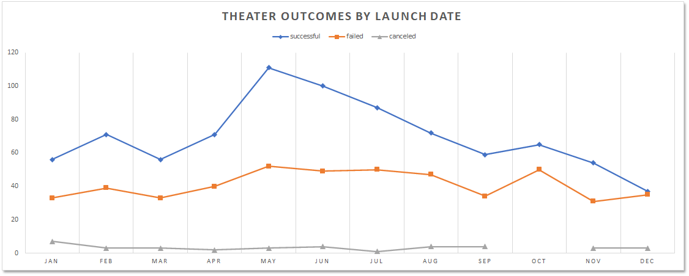
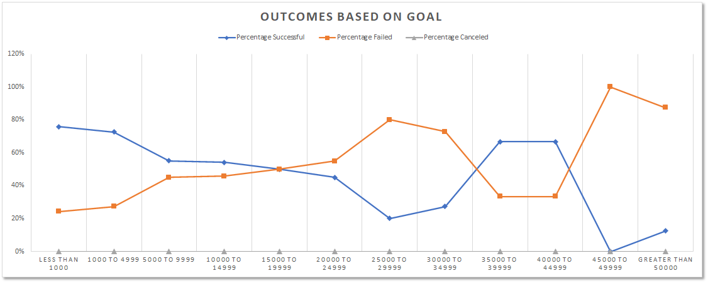

# Kickstarting with Excel

## Overview of Project
The purpose of this analysis is to assist *Louise* make an educated decision in regards to setting a reasonable campaign goal and selecting a good month to launch. This analysis will use historical data for other campaigns with emphasis on theatre ones. Insights derived by this analysis should lead *Louise* to a successful fundraising campaign.

## Analysis and Challenges

### Methodology
I started my analysis by collecting the historical campaigns dataset into Excel. After which I started with the data clean-up process. This process included formatting columns using the correct data types, splitting the category column into ***Parent Category*** and ***Subcategory***, converting the Unix timestamps into readable dates, and more.

Secondly, I pivoted the data to be able to compare facts by certain dimensions. This allowed me to compare campaign outcomes against different launch dates (months), and by different goals. Finally I created two charts to easily visualize the results.

### Challenges and Difficulties Encountered
A challenge I faced was to understand what format was the ***deadline*** & ***launched_at*** columns. But with the help of the class and Google, I was able to convert to date format. 

Another challenge was to exclude outliers from the ***goal*** column and errors resulting from division by zero from the ***Average Donation*** column. 

## Results

### What are two conclusions you can draw about the Outcomes based on Launch Date?
**Conclusion 1:** The best months to launch a campaign are May, June, and July.

**Conclusion 2:**  The worst months to launch a campaign are December and January.

### What can you conclude about the Outcomes based on Goals?
Campaigns with goal range of under 5k have the best chance of success. I would advise *Louise* to think about lowering her goal of 10k. Another observation is that campaigns with goal range between 35k-45k have a relatively high success percentage, I can't trust the data because the sample size is small.

### What are some limitations of this dataset?
It would be very helpful if the dataset included more information regarding the demographics and sociographics of the backers. This information would have helped Louise with her online advertising for the campaign.

Another important thing to note, the dataset is relatively outdated. Recent data would've been an added value.

### What are some other possible tables and/or graphs that we could create?
We could create a new column which we assign a genre to each ***plays*** subcategory and then create a pivot table and look at outcomes by genre. This might help *Louise* modify her play's title. Plotting this information on a bar chart would help us easily point-out the popular genres.

---

